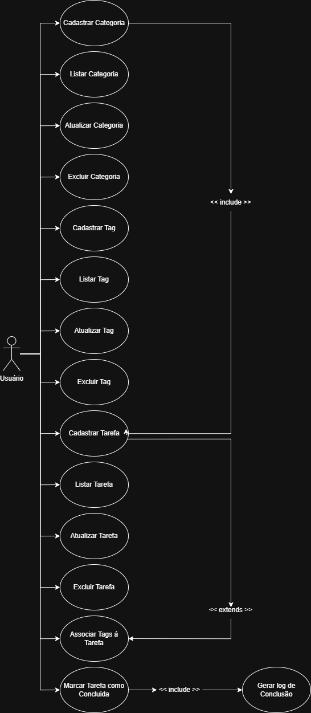
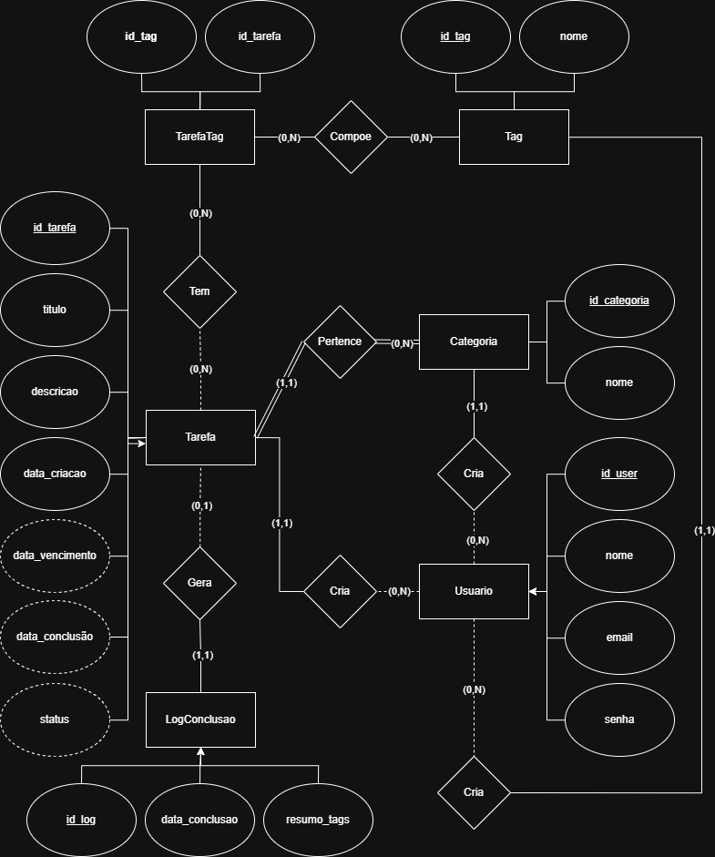

# Documentação - Fase I TP

**Alunos:**

- Felipe Portes Antunes
- Lucas Teixeira Reis
- Thayná Andrade Caldeira Antunes

**Professor:** Walisson Ferreira de Carvalho

**Link do Projeto:** [Checklist App](https://github.com/LucasReis26/checklist-app/tree/main)

## 1. Descrição do Problema 

O sistema deve permitir o cadastro e gerenciamento de **Tarefas**, **Categorias** e **Tags**, possibilitando a geração de Logs de Conclusão associados a tarefas finalizadas. Deve armazenar os dados em arquivo binário com cabeçalho e controle de exclusão lógica por lápide.

## 2. Objetivo do Trabalho

- Desenvolver um sistema que permita o **CRUD** de **Tarefas**, **Categorias** e **Tags**.
- Garantir persistência em arquivos binários com controle de exclusão lógica.
- Fornecer documentação contendo Diagrama de Caso de Uso (DCU), Diagrama Entidade-Relacionamento (DER) e Arquitetura Proposta.

## 3. Requisitos Funcionais

- **RF01 - Cadastro de Categorias:** O sistema deve permitir criar, listar, atualizar e excluir categorias (Ex: "Faculdade", "Trabalho").
- **RF02 - Cadastro de Tags:** O sistema deve permitir o gerenciamento de etiquetas independentes que serão associadas às tarefas.
- **RF03 - Cadastro de Tarefas:** O sistema deve permitir a criação de tarefas, vinculando-as a uma **Categoria** obrigatória.
- **RF04 - Associação N:N (Tarefas e Etiquetas):** O sistema deve permitir que uma tarefa tenha múltiplas etiquetas e que uma etiqueta pertença a múltiplas taefas.
- **RF05 - Geração de Log de Conclusão:** Ao marcar uma tarefa como "Concluída", o sistema deve gerar um registro de log (equivalente ao cupom do pedido) contendo o ID da tarefa, data de conclusão e resumo das etiquetas utilizadas
- **RF06 - Gerenciamento de Cabeçalho:** O sistema deve ler e atualizar oa cabeçalho do arquivo no início de cada operação para obter o último ID válido e garantir a unicidade.
- **RF07 - Exclusão Lógica:** Ao excluir um registro (Tarefa, Categoria ou Tag), o sistema **não deve** apagar os dados fisicamente, mas sim marcar o bit de "lápide" como ativo.
- **RF08 - Recuperação de Espaço:** O sistema deve ignorar registros com a lápide ativa durante as listagens e buscas comuns.
- **RF09 - Busca por termo:** O sistema deve ser capaz de localizar uma tarefa diretamente pelo sue ID, validando se o registro não está "morto". 
- **RF10 - Filtro por Categoria:** O sistema deve listar todas as tarefas associadas a uma categoria específica (Ex: mostrar tudo de "AEDS-III")

## 4. Requisitos Não Funcionais

- **RNF01** - O sistema nào poderá utilizar console como interface.
- **RNF02** - Interface mínima em HTML/CSS (pode ser estática).
- **RNF03** - Persistência obrigatória em arquivos binários com cabeçalho.
- **RNF04** - Documentação obrigatória (DCU + DER + Arquitetura).

## 5. Atores

- **Usuário:** Cria/adiciona/remove/conclui/exclui tarefas, cria/adiciona/remove/exclui categorias, cria/adiciona/remove/exclui tags.

## 6. Diagrama de Caso de Uso

## 7. Diagrama Entidade-Relacionamento

## 8. Arquitetura Proposta

O sistema seguirá o padrão **MVC + DAO**, onde:

- **Model:** Classes de domínio (Usuário, Tarefa, Categoria, Tags)
- **DAO:** Acesso a arquivos binários e lápide.
- **Controller:**
    **Operações do Usuário**
    - Criar Tarefa 
    - Excluir Tarefa
    - Atualizar Tarefa
    - Ler Tarefa
    - Criar Categoria
    - Excluir Categoria
    - Atualizar Categoria
    - Ler Categoria
    - Criar Tag
    - Excluir Tag
    - Atualizar Tag
    - Atribuir Tarefa a uma Categoria
    - Atribuir uma Tag a uma Tarefa
- **View:** Interface mínima HTML/CSS

